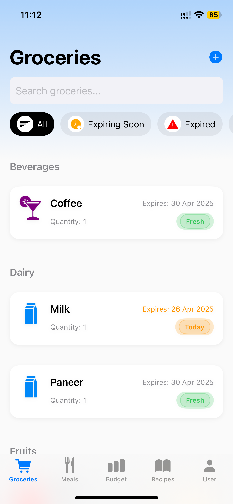
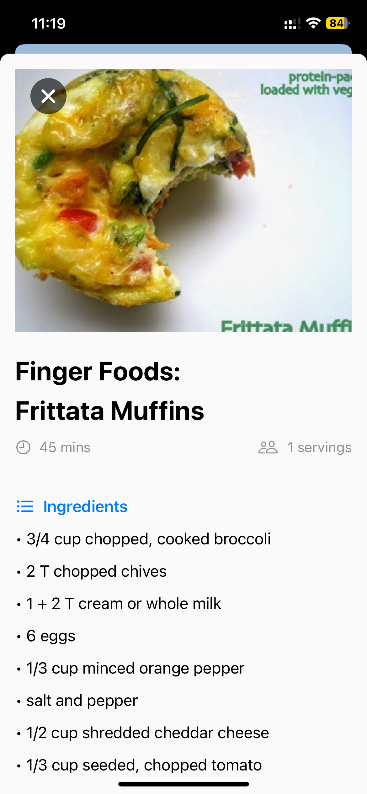
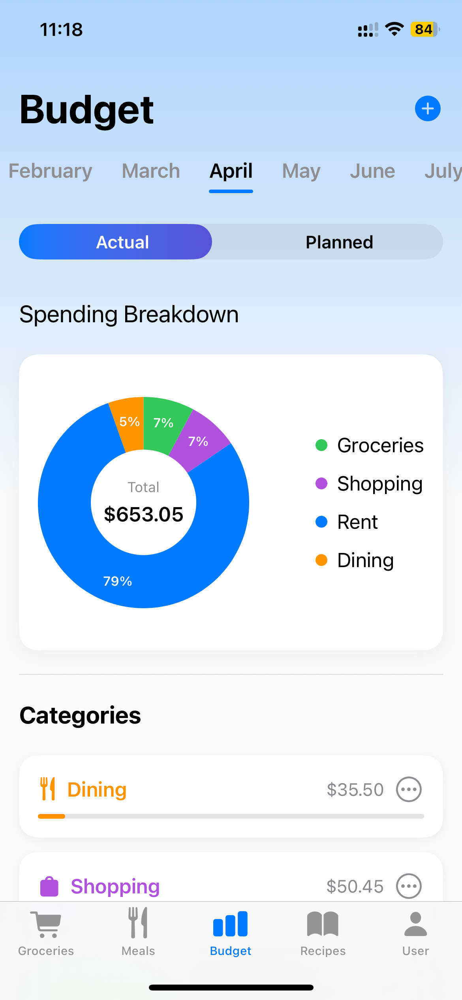
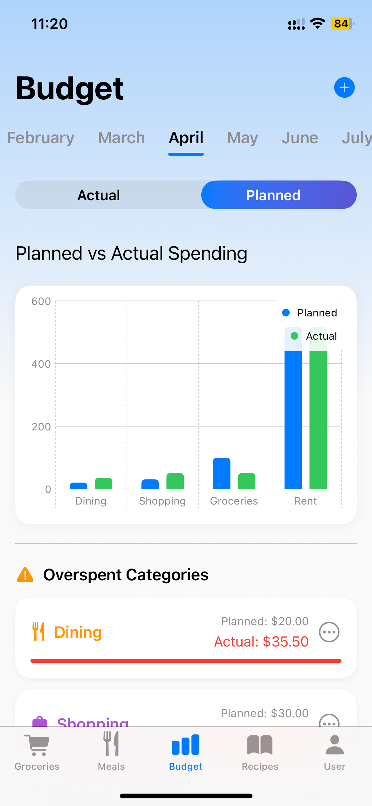

<div align="center">

# 🍽️ Mealgorithm

### _Your Life. In Sync._

**An AI-powered iOS app helping university students manage groceries, plan meals, and track budgets — all in one place.**


</div>

---

## 📖 About

Managing groceries, planning meals, and staying on a student budget is overwhelming — especially with a packed academic schedule and limited resources.

**Mealgorithm** solves this by combining AI-driven meal planning, proactive grocery tracking, and visual budget insights into a single, beautifully designed iOS app built for university students.

> 🥗 Reduces food waste by up to **30%**
> 💰 Saves students an estimated **$50–$100/month**

---

## 📱 App Preview

<table>
  <tr>
    <td align="center"><b>🛒 Grocery Management</b></td>
    <td align="center"><b>🤖 AI Meal Planning</b></td>
    <td align="center"><b>🔍 Recipe Exploration</b></td>
  </tr>
  <tr>
    <td></td>
    <td></td>
    <td></td>
  </tr>
  <tr>
    <td align="center"><b>📋 Recipe Detail</b></td>
    <td align="center"><b>💸 Budget Tracking</b></td>
    <td align="center"><b>📊 Spending Insights</b></td>
  </tr>
  <tr>
    <td></td>
    <td></td>
    <td></td>
  </tr>
</table>
 
---

## ✨ Features

### 🛒 Grocery Management

- Add groceries with name, quantity, and expiry date
- Daily **push notifications at 9 AM** for items nearing expiry
- Filter groceries by All / Expiring Soon / Expired
- Planned: grocery categorization and AI barcode scanning

### 🤖 AI-Driven Meal Planning

- Select meal types (Breakfast, Lunch, Dinner) across dates
- Personalized recipe suggestions based on dietary preferences
- Instant **recipe swapping** for flexibility
- Offline access to planned meals

### 🔍 Recipe Exploration

- Curated recipes fetched from the **Spoonacular API**
- Search by keywords or ingredients
- Full-screen detail views: Ingredients, Instructions, Nutrition, Cook Time

### 💸 Budget Tracking

- Track expenses across categories: Groceries, Rent, Dining, Shopping, Miscellaneous
- Visualize spending with **Pie Charts**
- Set monthly planned budgets per category
- **Bar Charts** comparing planned vs actual spending
- Overspending flagged visually with warnings

### 👤 User Personalization

- Onboarding captures dietary preference, grocery day, meal goal
- All suggestions and notifications personalized to your profile
- Update preferences anytime from Settings

### 🔔 Push Notifications

- Daily expiry reminders to reduce food waste
- Planned: meal prep reminders before cooking time

---

## 🏗️ Technical Architecture

| Layer                | Technology                        |
| -------------------- | --------------------------------- |
| Frontend UI          | SwiftUI                           |
| Data Persistence     | Core Data                         |
| External API         | Spoonacular API                   |
| Notifications        | UNUserNotificationCenter          |
| Data Visualization   | Swift Charts                      |
| Architecture Pattern | MVVM                              |
| State Management     | @State, @Binding, @ObservedObject |
| Navigation           | NavigationStack                   |

---

## 📁 Project Structure

```
Mealgorithm/
├── Mealgorithm/
│   ├── OnBoarding/          # Onboarding flow & personalization
│   ├── Groceries/           # Grocery management views & logic
│   ├── Meals/               # Meal planning views
│   ├── Recipe/              # Recipe exploration & detail views
│   ├── Budget/              # Budget tracking & charts
│   ├── Suggested Meal Plan/ # AI meal suggestion engine
│   ├── UserProfile/         # Settings & user preferences
│   ├── Assets.xcassets/     # Images, icons, colors
│   ├── DataModel.xcdatamodeld/  # Core Data model
│   ├── ContentView.swift
│   ├── MealgorithmApp.swift
│   └── PersistenceController.swift
└── Mealgorithm.xcodeproj/
```

---

## 🚀 Getting Started

### Prerequisites

- Xcode 15+
- iOS 17+
- A free [Spoonacular API key](https://spoonacular.com/food-api)

### Installation

1. **Clone the repository**

   ```bash
   git clone https://github.com/navaleprachi/Mealgorithm.git
   cd Mealgorithm
   ```

2. **Add your API key**

   Duplicate the template file and add your key:

   ```bash
   cp Mealgorithm/Secrets.swift.template Mealgorithm/Secrets.swift
   ```

   Then open `Secrets.swift` and replace the placeholder:

   ```swift
   let spoonacularAPIKey = "YOUR_API_KEY_HERE"
   ```

3. **Open in Xcode**

   ```bash
   open Mealgorithm.xcodeproj
   ```

4. **Build & Run**

   Select a simulator (iPhone 15 recommended) and hit `Cmd + R`

---

## 🆚 How Mealgorithm Compares

| Feature            | Mealgorithm | Meal Apps | Budget Apps | Grocery Apps |
| ------------------ | :---------: | :-------: | :---------: | :----------: |
| Meal Planning      |     ✅      |    ✅     |     ❌      |      ❌      |
| Budget Tracking    |     ✅      |    ❌     |     ✅      |      ❌      |
| Grocery Management |     ✅      |  Partial  |     ❌      |      ✅      |
| Expiry Tracking    |     ✅      |    ❌     |     ❌      |     Few      |
| AI Personalization |     ✅      |  Limited  |   Limited   |   Minimal    |
| All-in-One         |     ✅      |    ❌     |     ❌      |      ❌      |

---

## 🔮 Roadmap

**Short Term**

- [ ] Grocery categorization + AI barcode scanning
- [ ] Meal prep reminders
- [ ] Grocery-to-buy list integration

**Medium Term**

- [ ] Cloud syncing with CloudKit / Firebase
- [ ] Instacart integration for direct grocery ordering
- [ ] Collaborative meal and grocery planning

**Long Term**

- [ ] AI-powered grocery predictions
- [ ] Nutrition analytics and gamification
- [ ] Premium subscription features

---

## 👩‍💻 Author

**Prachi Navale**
Frontend Engineer · MS Information Systems, Northeastern University

[](https://www.linkedin.com/in/prachi-navale/)
[](https://prachinavale-portfolio.netlify.app/)
[](https://github.com/navaleprachi)

---

## 📄 License

This project was developed as a final project for **INFO 6350 Smartphones-Based Web Development** at Northeastern University (Spring 2025).

---

<div align="center">
  <i>Built with ❤️ for students who want to eat well, waste less, and spend smarter.</i>
  <br/><br/>
 
  Copyright © 2025 Prachi Navale · All rights reserved.
</div>
